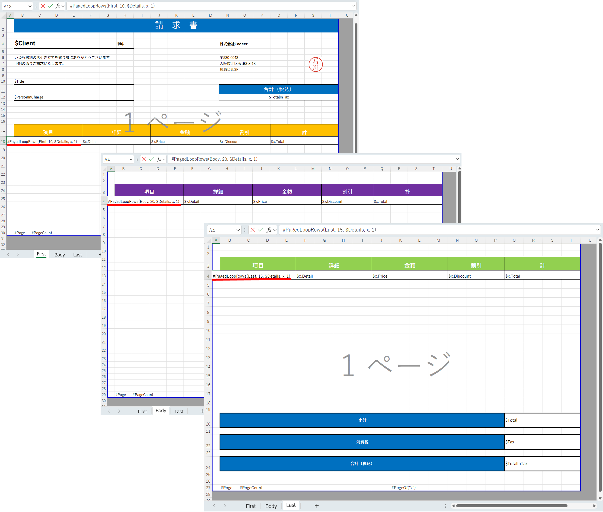
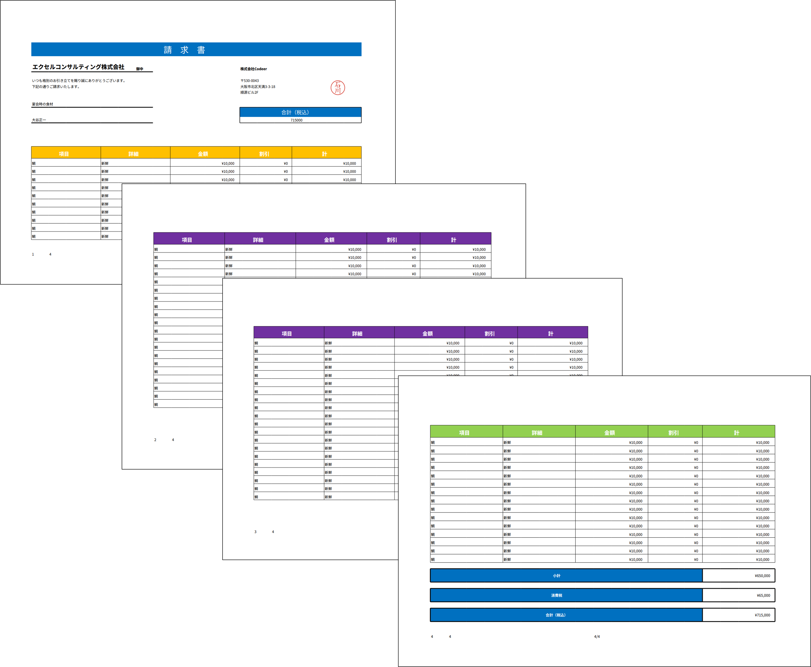
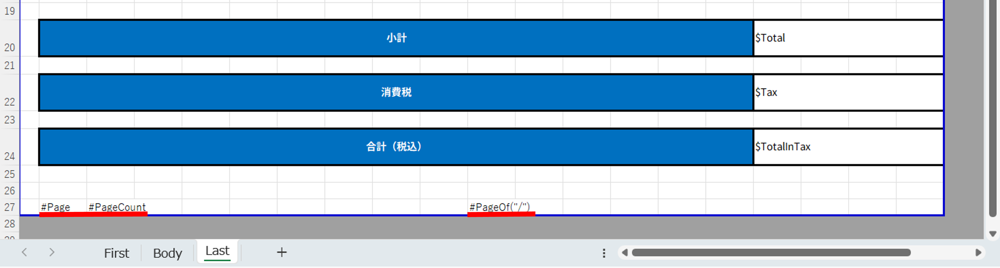

# Excel.Report.PDF

## Features ...
Convert Excel to PDF.<br>


Overwrite Excel with data according to the symbol.(And convert to Excel to PDF)<br>


## Getting Started
Excel.Report.PDF from NuGet.

    PM> Install-Package Excel.Report.PDF

First you need to implement IFontResolver.
This is a PDFsharp feature used internally.
I think you can understand if you refer to the test project.
->Source/Test/Test
```csharp
public class CustomFontResolver : IFontResolver
{
    public byte[] GetFont(string faceName)
        //Implement so that you can get as many fonts as you need.
        => faceName.EndsWith("#b") ? Resources.NotoSansJP_ExtraBold : Resources.NotoSansJP_Regular;

    public FontResolverInfo ResolveTypeface(string familyName, bool isBold, bool isItalic)
    {
        var faceName = familyName; 
        if (isBold) faceName += "#b";
        return new FontResolverInfo(faceName);
    }
}
```
```csharp
GlobalFontSettings.FontResolver = new CustomFontResolver();
```

Next, you can convert by specifying Excel. The first argument is the Excel path or Stream, and the second argument is the number or name of the target sheet.
```csharp
using var outStream = ExcelConverter.ConvertToPdf(workbookPath, 1);
File.WriteAllBytes(pdfPath, outStream.ToArray());
```
## Overwrite Excel
There is also a function to overwrite Excel.
First, create an Excel file according to the rules.

### 1. [$]
Write the string you want to convey to the program after the $ sign.<br>


### 2. [#LoopRow($elements, elementName, copyRowCount)]
It can be specified in column A. Copies the specified row as many times as copyRowCount and adds the row.
In the copied column, you can specify the symbol of the repeating element using elementName.

| Name |  |
| ---- | ---- |
| $elements | A loop element. Specifies the symbol returned by IEnumerable. |
| elementName | The name of a repeating element used within a row. |
| copyRowCount | Number of rows to copy. |

<br>

Next, programmatically overwrite this Excel.
Pass IExcelSymbolConverter to the OverWrite method.
This sample uses ObjectExcelSymbolConverter, which is one of the implementations of IExcelSymbolConverter provided by Excel.Report.PDF.
IExcelSymbolConverter is easy to implement, so please try implementing it according to your situation.
In that case, the implementation of ObjectExcelSymbolConverter will be helpful.

```csharp
//Sample data.
var data = new Quotation 
{
    Title = "宴会時の食材",
    Client = "エクセルコンサルティング株式会社",
    PersonInCharge = "大谷正一"
};
data.Details.Add(new()
{
    Title = "鯛",
    Detail = "新鮮",
    Price = 10000,
    Discount = 0,
});
data.Details.Add(new()
{
    Title = "鰤",
    Detail = "新鮮",
    Price = 20000,
    Discount = 0,
});
data.Details.Add(new()
{
    Title = "ハマチ",
    Detail = "ご奉仕品",
    Price = 30000,
    Discount = 2000,
});
data.Details.Add(new()
{
    Title = "蛸",
    Detail = "ご奉仕品",
    Price = 40000,
    Discount = 1000,
});

using var book = new XLWorkbook(filePath);
var symbolConverter = new ObjectExcelSymbolConverter(data);
await book.Worksheet(1).OverWrite(new ObjectExcelSymbolConverter(data));

// Convert Excel to PDF
var newStream = new MemoryStream();
book.SaveAs(newStream);
using var outStream = ExcelConverter.ConvertToPdf(newStream, 1);
File.WriteAllBytes(pdfPath, outStream.ToArray());
```

### 3. [#PagedLoopRows(pageType, rowsPerPage, $elements, elementName, blockRowCount)]
It can be specified in column A.Copies the specified row as many times as blockRowCount and adds the row.  
By specifying pageType and rowsPerPage, you can configure the page layout and the number of rows displayed per page for each of the three page types: `First` (first page), `Body` (middle pages), and `Last` (final page).

* **First**: The page that appears once at the very beginning of the report or list.
* **Body**: The middle pages used to output the main data across multiple pages.
* **Last**: The page that appears once at the very end to close the report or list.

| Name |  |
| ---- | ---- |
| pageType | Specify the page type. For each loop, select exactly one of: First, Body, or Last. |
| rowsPerPage | Number of lines to display per page. |
| $elements | A loop element. Specifies the symbol returned by IEnumerable. |
| elementName | The name of a repeating element used within a row. |
| blockRowCount | Number of rows to copy. |

<br>
MultiPageSheetSample


MultiPageSheetSample convert to PDF

Please refer to "2. [#LoopRow($elements, elementName, copyRowCount)]" for sample data.

### 4. \[\#Page][#PageCount][#PageOf("/")]
It can display number of pages. It can be specified in any column except column A. It is only available for PDF output.
| Name |  |
| ---- | ---- |
| #Page | Current number of pages. |
| #PageCount | Total number of pages. |
| #PageOf("/") | Current and total page counts. Specify the separator in the parentheses (e.g., "of").|

<br>


## Special Rendering Directives

### 1. `#Empty`
By default, only cells that contain values are rendered into the PDF.  
If you put `#Empty` in a cell, the text itself will not be drawn, but **the cell’s area will still be included in the rendering range**.

Use this when you want the cell’s presence to affect the layout, but you don’t want any visible text.

### 2. `#FitColumn`
This can only be specified in the `A1` cell.  
If you write `#FitColumn` in `A1`, the content will be automatically scaled so that it fits the PDF drawing area **based on the Excel column width**, excluding the left and right margins.

Use this when you want the PDF display size to be adjusted according to the column width in Excel.
