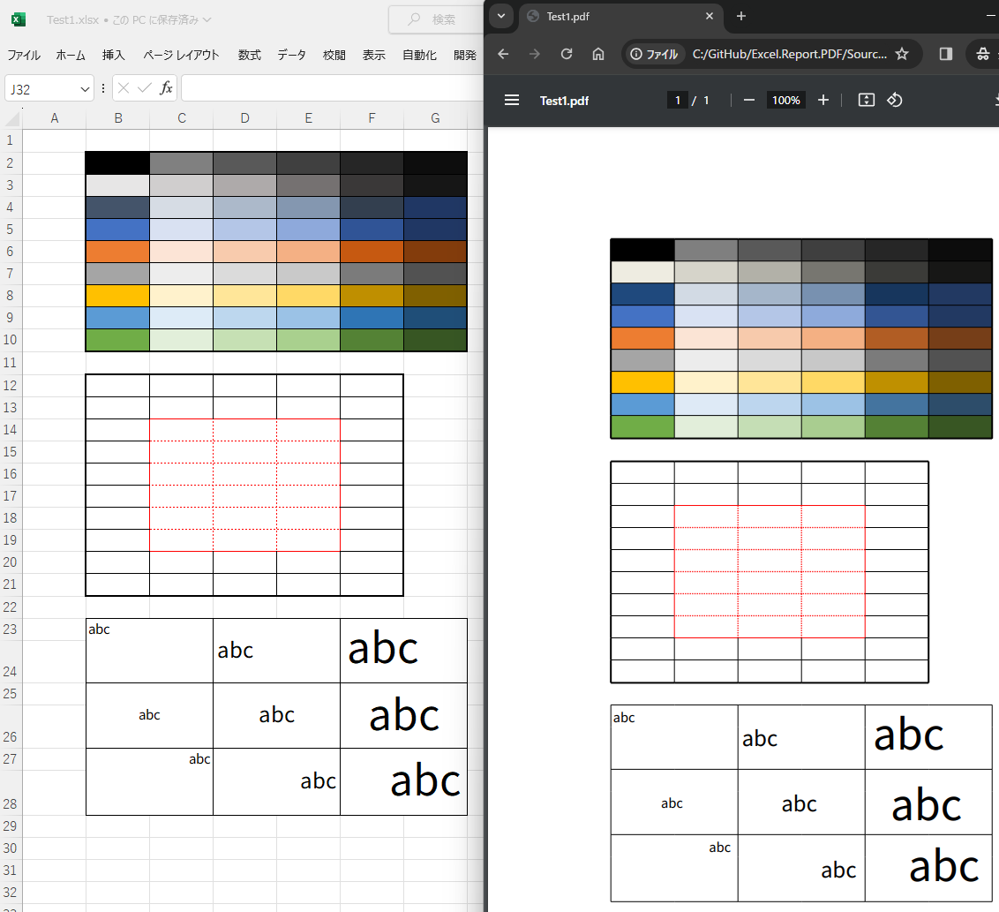
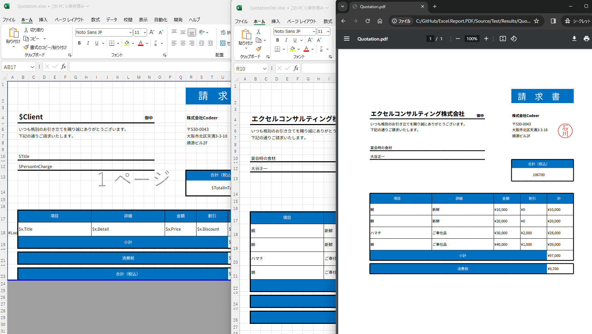

# Excel.Report.PDF

[](https://www.nuget.org/packages/Excel.Report.PDF/)
[](https://www.nuget.org/packages/Excel.Report.PrintDocument/)
[](LICENSE)

A .NET library that converts Excel workbooks into PDF and turns Excel files into reusable, data-driven report templates — without depending on Microsoft Office or COM Interop.

* **Excel → PDF**: Pure managed conversion via [ClosedXML](https://github.com/ClosedXML/ClosedXML) + [PdfSharp](https://github.com/empira/PDFsharp).
* **Template engine**: Place `$symbols` and `#directives` directly in cells and overwrite the workbook with your data at runtime.
* **Multi-page reports**: Split long lists across `First` / `Body` / `Last` page templates with automatic page numbering.
* **Built-in renderers**: Drop in dynamic images and QR codes from cell directives, or register your own.
* **GDI+ printing**: Bind the same rendering pipeline to `System.Drawing.Printing.PrintDocument` (Windows) for preview / direct printing.

| Excel → PDF | Quotation template |
| --- | --- |
|  |  |

---

## Table of contents

* [Install](#install)
* [Quick start](#quick-start)
  * [1. Set up a font resolver](#1-set-up-a-font-resolver)
  * [2. Convert Excel to PDF](#2-convert-excel-to-pdf)
  * [3. Overwrite a template, then convert](#3-overwrite-a-template-then-convert)
* [Cell directive reference](#cell-directive-reference)
* [Detailed documentation](#detailed-documentation)
* [Requirements](#requirements)
* [License](#license)

---

## Install

```powershell
# Core: Excel → PDF + template engine
PM> Install-Package Excel.Report.PDF

# Optional: Bind to System.Drawing.Printing (Windows only — preview / printer output)
PM> Install-Package Excel.Report.PrintDocument
```

`Excel.Report.PDF` targets **.NET 6.0** and runs on Windows / Linux / macOS.
`Excel.Report.PrintDocument` is Windows-only because it depends on GDI+ via `System.Drawing.Common`.

---

## Quick start

### 1. Set up a font resolver

PdfSharp does not ship with fonts. Implement `IFontResolver` once at startup and return whichever font bytes you want PdfSharp to embed.

```csharp
using PdfSharp.Fonts;

public class CustomFontResolver : IFontResolver
{
    public byte[] GetFont(string faceName)
        => faceName.EndsWith("#b") ? Resources.NotoSansJP_ExtraBold
                                   : Resources.NotoSansJP_Regular;

    public FontResolverInfo ResolveTypeface(string familyName, bool isBold, bool isItalic)
    {
        var faceName = familyName;
        if (isBold) faceName += "#b";
        return new FontResolverInfo(faceName);
    }
}

GlobalFontSettings.FontResolver = new CustomFontResolver();
```

A more sophisticated example that loads fonts directly from the Windows Fonts registry lives in
[`Source/TestWinFormsApp/WindowsInstalledFontResolver.cs`](Source/TestWinFormsApp/WindowsInstalledFontResolver.cs).

See **[docs/getting-started.md](docs/getting-started.md)** for the full setup walkthrough.

### 2. Convert Excel to PDF

```csharp
using Excel.Report.PDF;

// Whole workbook → multi-page PDF
using var pdf = ExcelConverter.ConvertToPdf("report.xlsx");
File.WriteAllBytes("report.pdf", pdf.ToArray());

// Specific sheet by 1-based position
using var pdfSheet1 = ExcelConverter.ConvertToPdf("report.xlsx", 1);

// Specific sheet by name
using var pdfNamed = ExcelConverter.ConvertToPdf("report.xlsx", "Summary");

// Stream overloads are also available
using var fs = File.OpenRead("report.xlsx");
using var pdfFromStream = ExcelConverter.ConvertToPdf(fs);
```

The renderer respects Excel's page setup (paper size, margins, scaling, page breaks, centering) and reproduces fonts, fills, borders (including `Double`), text rotation, vertical text, and embedded pictures.

### 3. Overwrite a template, then convert

Drop `$symbols` and `#directives` straight into your `.xlsx` template, then bind a data object at runtime.

```csharp
using ClosedXML.Excel;
using Excel.Report.PDF;

var data = new Quotation
{
    Title = "Banquet ingredients",
    Client = "Excel Consulting Inc.",
    PersonInCharge = "Shoichi Otani",
};
data.Details.Add(new() { Title = "Sea bream", Detail = "Fresh",      Price = 10000, Discount = 0    });
data.Details.Add(new() { Title = "Yellowtail", Detail = "Fresh",     Price = 20000, Discount = 0    });
data.Details.Add(new() { Title = "Hamachi",    Detail = "Bargain",   Price = 30000, Discount = 2000 });
data.Details.Add(new() { Title = "Octopus",    Detail = "Bargain",   Price = 40000, Discount = 1000 });

using var book = new XLWorkbook("Quotation.xlsx");

// Overwrite a single sheet
await book.Worksheet(1).OverWrite(new ObjectExcelSymbolConverter(data));

// ...or overwrite every sheet (and expand multi-page #PagedLoopRows templates)
// await book.OverWrite(new ObjectExcelSymbolConverter(data));

// Render the populated workbook to PDF
using var ms = new MemoryStream();
book.SaveAs(ms);
using var pdf = ExcelConverter.ConvertToPdf(ms, 1);
File.WriteAllBytes("Quotation.pdf", pdf.ToArray());
```

`ObjectExcelSymbolConverter` resolves symbols against the public properties of the bound object (and supports nested loops). To map symbols to a database row, an API response, or any other source, implement [`IExcelSymbolConverter`](Source/Excel.Report.PDF/IExcelSymbolConverter.cs) — see **[docs/template-overwrite.md](docs/template-overwrite.md)**.

---

## Cell directive reference

All directives live in cell text. `$` resolves to a value; `#` invokes a function, loop, or rendering command.

| Directive | Where | Purpose |
| --- | --- | --- |
| `$name` | any cell | Replace the cell value with `converter.GetData("name")`. |
| `#LoopRow($items, item, n)` | column **A** | Insert-mode loop. Copies `n` rows above the current row, once per element of `$items`. |
| `#LoopRowData($items, item, n)` | column **A** | Data-only loop. Reuses the existing row format and writes values without inserting rows. |
| `#PagedLoopRows(pageType, rowsPerPage, $items, item, blockRowCount)` | column **A** | Distributes a long list across `First` / `Body` / `Last` template sheets — see [docs/multi-page.md](docs/multi-page.md). |
| `#Image($bytesOrStream[, widthScale[, heightScale]])` | any cell | Insert a picture from `byte[]` or `Stream`. |
| `#QR($text[, pixelsPerModule])` | any cell | Insert a QR code (PNG, ECC level **M**). Default `pixelsPerModule = 10`. |
| `#Page` | any cell except column A | Render the current page number when converting to PDF. |
| `#PageCount` | any cell except column A | Render the total page count (resolved after layout). |
| `#PageOf("/")` | any cell except column A | Render `current<separator>total`. The separator is the literal in the parentheses. |
| `#Empty` | any cell | Reserve the cell area for layout calculations but draw nothing. |
| `#FitColumn` | **A1** only | Scale the rendered output so the used column width fills the printable page width. |

Multiple cell directives can coexist on the same cell separated by `|` (for example `#Empty | #FitColumn`).

Detailed semantics, edge cases, and worked examples are split across the documents below.

---

## Extending with your own `#Function`

`#Image` and `#QR` are themselves implementations of the public [`IOverWriteFunction`](Source/Excel.Report.PDF/IOverWriteFunction.cs) interface. You can register additional `#YourName(...)` directives in **two lines of code** — there are no internal hooks involved.

```csharp
using ClosedXML.Excel;
using Excel.Report.PDF;

public sealed class UpperFunction : IOverWriteFunction
{
    public string Name => "Upper";   // matched as "#Upper(...)"

    public Task InvokeAsync(IXLWorksheet sheet, int rowIndex, int colIndex, object?[] args)
    {
        var text = args.ElementAtOrDefault(0)?.ToString() ?? string.Empty;
        sheet.Cell(rowIndex, colIndex).SetValue(XLCellValue.FromObject(text.ToUpperInvariant()));
        return Task.CompletedTask;
    }
}

// Register once at startup
ExcelOverWriter.RegisterOverWriteFunction(new UpperFunction());
```

Then in any cell:

```text
#Upper($Client)
```

`args` already has `$symbols` resolved by your `IExcelSymbolConverter`. See **[docs/built-in-functions.md](docs/built-in-functions.md)** for argument-parsing rules, real-world recipes (barcodes, signature stamps, computed totals, async DB lookups), and the full extensibility contract.

---

## Detailed documentation

* **[Getting started](docs/getting-started.md)** — install, font resolvers, every `ExcelConverter.ConvertToPdf` overload, troubleshooting.
* **[Template overwrite](docs/template-overwrite.md)** — `$symbols`, `#LoopRow` vs `#LoopRowData`, nested loops, custom `IExcelSymbolConverter`.
* **[Multi-page reports](docs/multi-page.md)** — `#PagedLoopRows`, the `First` / `Body` / `Last` page model, and how rows are distributed.
* **[Built-in cell functions](docs/built-in-functions.md)** — `#Image`, `#QR`, and writing your own `IOverWriteFunction`.
* **[PrintDocument integration](docs/print-document.md)** — bind the renderer to `System.Drawing.Printing.PrintDocument` for print preview / direct printing on Windows.
* **[Special rendering directives](docs/special-directives.md)** — `#Empty`, `#FitColumn`, page-number directives, vertical / rotated text.
* **[Public API reference](docs/api-reference.md)** — every public type, method, and extension across both packages.

---

## Requirements

| Package | Target | Key dependencies |
| --- | --- | --- |
| `Excel.Report.PDF` | `net6.0` | ClosedXML 0.105.x, PdfSharp 6.2.x, QRCoder 1.7.x |
| `Excel.Report.PrintDocument` | `net6.0` (Windows) | `Excel.Report.PDF`, `System.Drawing.Common` 8.0.x |

Both libraries are pure managed code — **no Microsoft Office, no COM, no native interop**.

---

## License

[MIT](LICENSE) © Codeer Software
