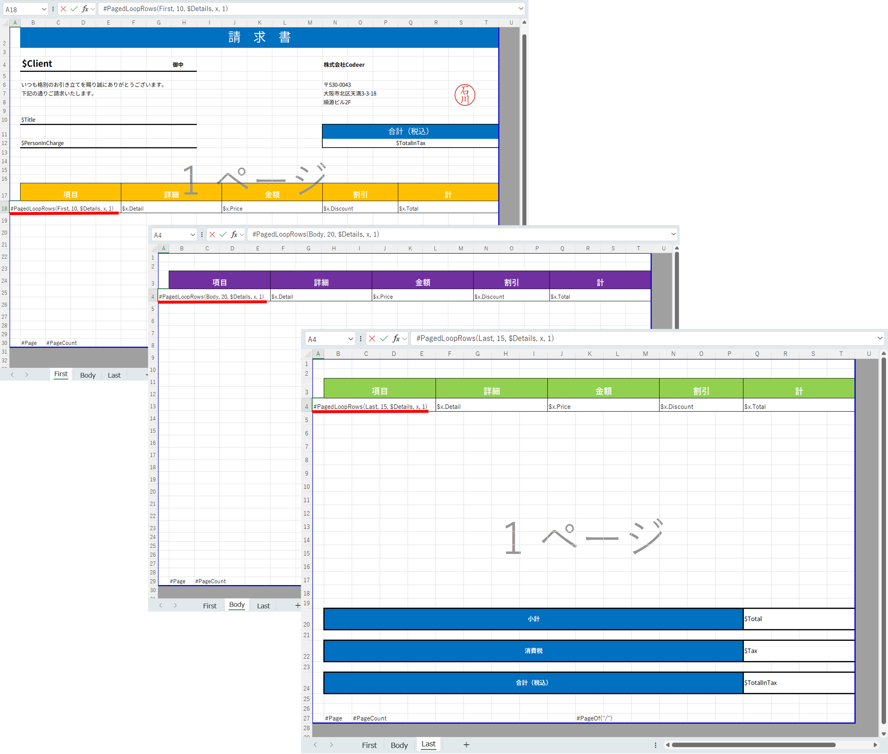
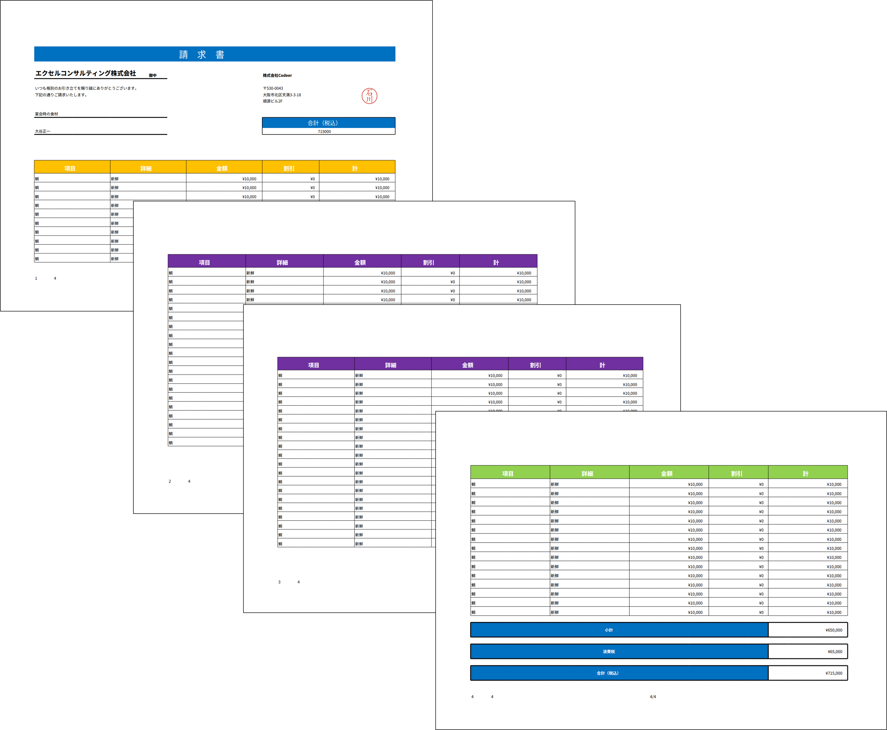

# Multi-page reports — `#PagedLoopRows`

`#PagedLoopRows` distributes a single logical list across multiple template sheets so that a long collection becomes a paginated report with a distinct **first page**, repeating **body pages**, and a **last page**.

## When to use it

Use `#PagedLoopRows` instead of `#LoopRow` when:

* The report needs different layouts for the cover page, the recurring middle pages, and the closing page (totals, signatures, etc.).
* The list does not fit on a single page and you want the engine to handle pagination for you.
* You want exact control over the number of rows on each page.

## Syntax

```text
#PagedLoopRows(pageType, rowsPerPage, $items, itemName, blockRowCount)
```

Place the directive in **column A** of the sheet that represents that page type. Each sheet may contain at most **one** `#PagedLoopRows` directive — the engine throws if it finds more.

| Argument | Description |
| --- | --- |
| `pageType` | One of `First`, `Body`, `Last`. |
| `rowsPerPage` | Number of list elements that should be rendered on this page. |
| `$items` | The list to iterate. The leading `$` is mandatory. The same `$items` value links the three sheets together. |
| `itemName` | The name used inside the block to reference each element (`$itemName.Property`). |
| `blockRowCount` | Number of rows that form a single record block. The block is copied `rowsPerPage` times. |

## The three page types

* **First** — appears once at the very beginning. Optional. Useful for cover pages, summary banners, or shorter header lists.
* **Body** — repeats as many times as needed. The engine duplicates this sheet automatically (named `body_0`, `body_1`, …) until the remaining items fit into the **Last** page.
* **Last** — appears once at the very end. Optional. Common uses include closing totals, signatures, or a "thank you" footer.

A workbook does not have to define all three; any subset works:

| Defined sheets | Behaviour |
| --- | --- |
| First + Body + Last | Items go to First first, body sheets next, leftovers to Last. |
| Body + Last | Items go to body sheets, leftovers to Last. |
| First + Last | Items go to First, leftovers to Last (no body duplication). |

## How the engine distributes items

Given `total = items.Count`, `f = First.rowsPerPage`, `l = Last.rowsPerPage`, `b = Body.rowsPerPage`:

1. **Body capacity** = `total - f - l`.
2. **If `body capacity == 0`** (everything fits in `First` + `Last`):
   * If `total > f`, the first `f` items go to **First** and the rest to **Last**.
   * If `total <= f`, the last item is moved to **Last** so the closing template is never blank, and the rest fill **First**.
3. **Otherwise**, the engine:
   * Sends the first `f` items to **First**.
   * Greedily fills body sheets `b` items at a time (`body_0`, `body_1`, …).
   * Sends whatever remains (`<= l` items) to **Last**.

The body template sheet is **renamed and replaced** by its expansions, so after `OverWrite` only `body_0`, `body_1`, … exist — the original `body` sheet is removed.

## Worked example

A workbook with three sheets `first`, `body`, `last`. The body sheet contains:

```text
A1:  #PagedLoopRows(Body, 30, $Details, item, 1)
A2:  $item.Number   $item.Text
```

When you bind a list of 100 elements with `f = 10`, `b = 30`, `l = 10`:

* Body capacity = `100 - 10 - 10 = 80`, which fits in `⌈80 / 30⌉ = 3` body pages.
* Resulting sheets: `first` (10 items) → `body_0` (30) → `body_1` (30) → `body_2` (20) → `last` (10).

Convert with `ExcelConverter.ConvertToPdf(...)` (no sheet specified) to render every sheet into the PDF.

## Calling convention

Multi-page expansion only happens when you call the **workbook-level** overwrite:

```csharp
await book.OverWrite(new ObjectExcelSymbolConverter(data));
```

The single-sheet overload (`book.Worksheet(1).OverWrite(...)`) does not duplicate body sheets and only expands the directive on the sheet you pass in.

## Visual reference

| Template | PDF result |
| --- | --- |
|  |  |

## Page numbering

Use `#Page`, `#PageCount`, and `#PageOf("/")` from [special-directives.md](special-directives.md) inside the templates to render `1 / 5` style page numbers. These directives only render when the workbook is being converted to PDF — they are no-ops when the populated workbook is opened in Excel.
